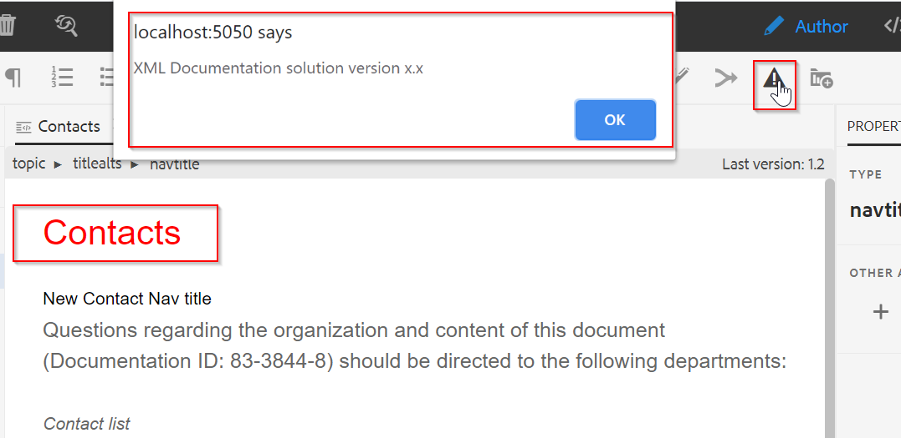
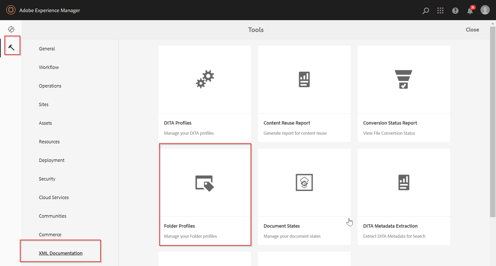
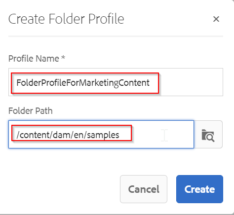
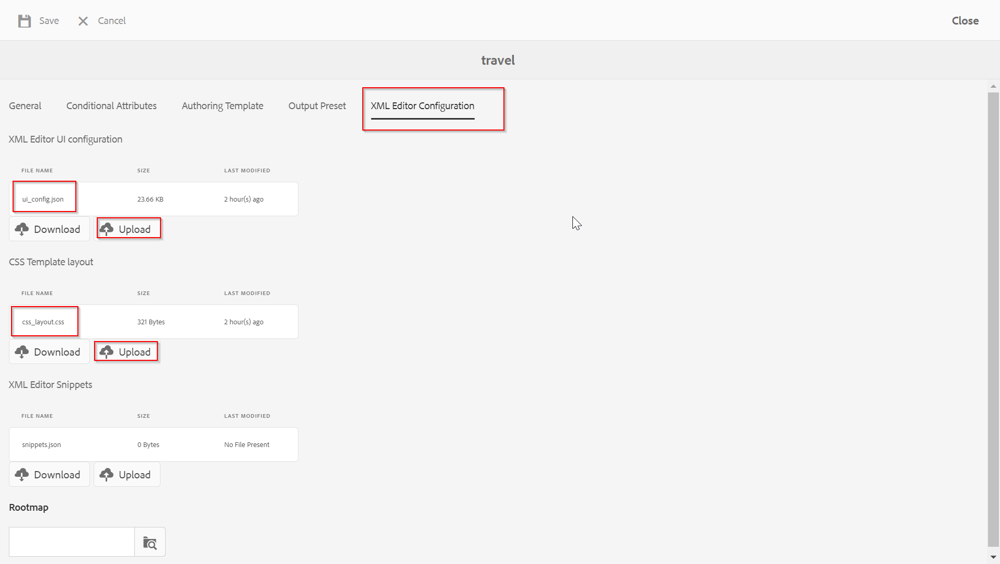

Web Editor Customizations
========

The XML Documentations' webeditor can be customized in various ways. This section will contain customizations like:
- Changing the tools/behavior of buttons in the toolbar shown on the webeditor
- Adding new custom tool on the toolbar

Examples in this package:
========
- Add a custom button on webeditor toolbar and show an alert to user on click.
- Customize webeditor author/preview mode to show title in Red color.

How to Deploy?
========
1) Download the sample-js-for-customization.zip package from generated-packages folder and install it via CRX package manager
	- This will add the sample js code under /apps/fmdita/custom
2) Create a custom Folder profile by login on to AEM 
	- Navigate to Tools-->XML Documentation-->Folder Profiles
	
	- Create a new Profile and add a folder path        
	
		
	- Go to the XML Editor Configuration and update the ui_config.json and css_layout.css as provided under generated-packages folder
	

How to test?
========
1) Clean the browser cache and cookies
2) Login to the AEM, choose profile from User Preferance as created in previous section
3) Open any topic for editing
4) You will get the new icon in toobar and also the title of the topic will be shown as red

Compatibility
========
The customization is tested with following versions of AEM:
AEM 6.5
XML Documentation 3.6.5
