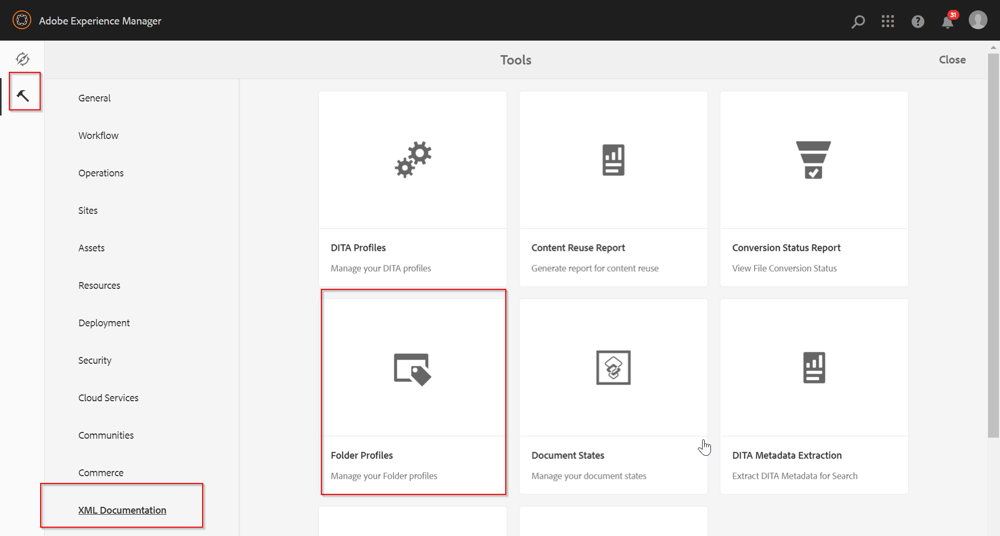
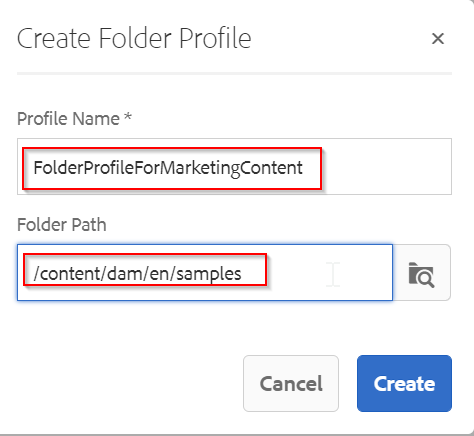
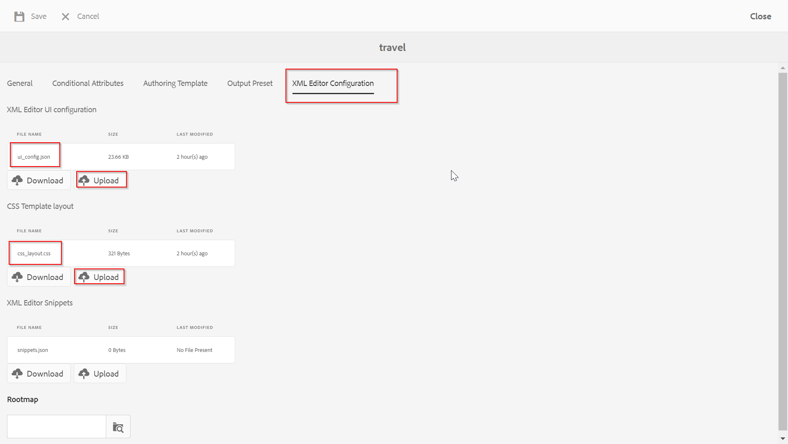
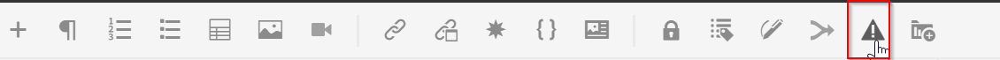
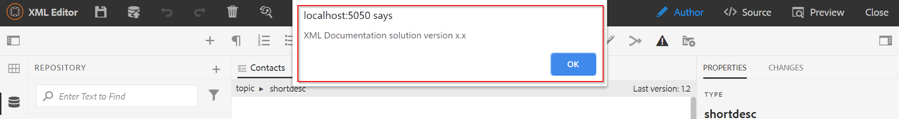
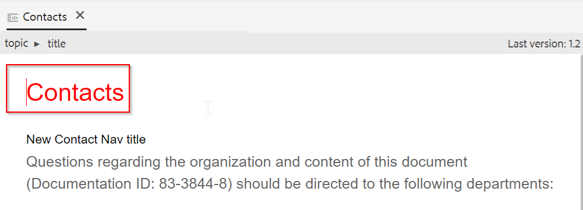

Examples in this package:
========
- Add a custom button on webeditor toolbar and show an alert to user on click.
- Customize webeditor author/preview mode to show title in Red color.

How to Deploy?
========
1) Download the sample-js-for-customization.zip package from generated-packages folder and install it via CRX package manager
	- This will add the sample js code under /apps/fmdita/custom
2) Create a custom Folder profile by login on to AEM 
	- Navigate to Tools-->XML Documentation-->Folder Profiles
	
	
	- Create a new Profile and add a folder path        
		
	
	- Go to the XML Editor Configuration and update the ui_config.json and css_layout.css as provided under generated-packages folder
	

Code References:
========
1) Adding a button in webeditor toolbar
	- Refer ui_config.json provided under generated-packages and search for below snippet.
		{
		  "type": "button",
		  "icon": "alert",
		  "variant": "quiet",
		  "title": "Click here",
		  "on-click": "custom.alert"
        }
	- It adds an alert button with title as 'Click here' in toolbar. The action for 'on-click' event is registered with 'custom.alert' key which has been defined in "/apps/fmdita/custom/clientlib/js/custom.js". This js is a part of the sample-js-for-customization.zip package provided under generated-packages
	
	
	
	
	
2) Making changes in webeditor author/preview mode to show title in Red color
	- Refer css_layout.css provided under generated-packages. It has the corresponding css defined for showing the title in Red color.
		
	
	
How to test?
========
1) Clean the browser cache and cookies
2) Login to the AEM, choose profile from User Preferance as created in previous section
3) Open any topic for editing
4) You will get the new icon in toobar and also the title of the topic will be shown as red

PROD Depolyment process
========
1) The final package for PROD should have below paths defined under filter:
	- /apps/fmdita/custom/clientlib - Where custom js is defined
	- /content/fmdita/folderprofiles/<folderprofileid> - Once you create a Folder Profile, it creates node under /content/fmdita/folderprofiles (Example- /content/fmdita/folderprofiles/8c1e95d1-43de-0c7c-533f-164c8095537a). This will have the ui_config.css and css_layout.css files. 

Compatibility
========
The customization is tested with following versions of AEM:
AEM 6.5
XML Documentation 3.6.5
